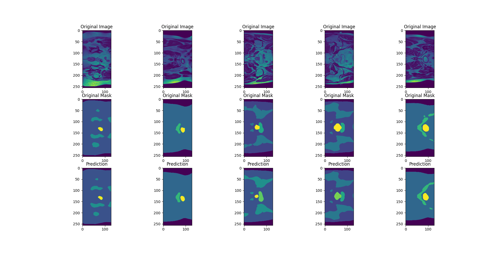

## Project:
1. Segment the HipMRI Study on Prostate Cancer using the processed 2D slices (2D images) with the 
2D UNet with all labels having a minimum Dice similarity coefficient of 0.75 on the test set on 
the prostate label.

## Description
The algorithm use a 2D UNet model to learn the segmentation problem of a HipMRI Study on Prostate Cancer.
It receive input of Nifti style file of medical image, which is then segmented and mapped using one hot 
encoding. The result show that the model can predict on unseen data with Dice similarity coefficient of 0.96,
which is considered successful.

## How it works
The algorithm is built on Tensorflow Keras framework. The algorithm load Nifti files, then normalise input 2D images, 
and one hot encode segmentations. The model used is 2D UNet, which is descriped with the figure below. The UNet have 
the latent layer of 1024 filters, most activation function is ReLU, except final segmentation activation function is 
sigmoid. The data is trained for 10 epochs with adam optimizer and dsc as validation and loss function.


## Results
The results show that the model improve loss and dsc over training. It perform well on unseen data, which mean it is 
not overfitting.
<br>
<br>
<br>
<br>

## Usage Instruction
### Dependencies
cudatoolkit               11.2.2<br>
cudnn                     8.1.0.77<br>
h5py                      3.12.1<br>
keras                     2.10.0<br>
matplotlib                3.9.2<br>
nibabel                   5.3.1<br>
nilearn                   0.10.4<br>
numpy                     1.26.4<br>
python                    3.9.20<br>
pyyaml                    6.0.2<br>
scikit-image              0.24.0<br>
scikit-learn              1.5.2<br>
scipy                     1.13.1<br>
tensorflow                2.10.1<br>
tqdm                      4.66.5<br>

### Run train.py
Run with:
```
python train.py <dataset_dir> [epochs] [batch_size]
```
If not specified, default of epochs is 5, and batch_size is 16

### Validate result with predict.py
Run with:
```
python predict.py <dataset_dir> [num_predict] [batch_size]
```
num_predict: number of predicts visualised
If not specified, default of num_predict is 5, and batch_size is 16

## Pipeline
### Dataloader - Preprocessing
Read Nifti medical image files. Found that some image have different size, therefore transform and resize
to (256, 128). Categorise segmentations to one hot encoding of 6 channels. Normalise 2D slices case image.
Use DataGenerator class to reduce GPU memory requirement.

### Modules - 2D UNet
Each Conv2D and Conv2DTranpose (3x3) is followed by a BatchNormalization and ReLU activation function.
The skip connection is concatenate with current layer at axis 3.


### Training
Training with 10 epochs, improvement significantly reduced after 5 epochs, and neglectable after 8 epochs. Model is saved
with .keras file extension.

### Validating
Validate on unseen data